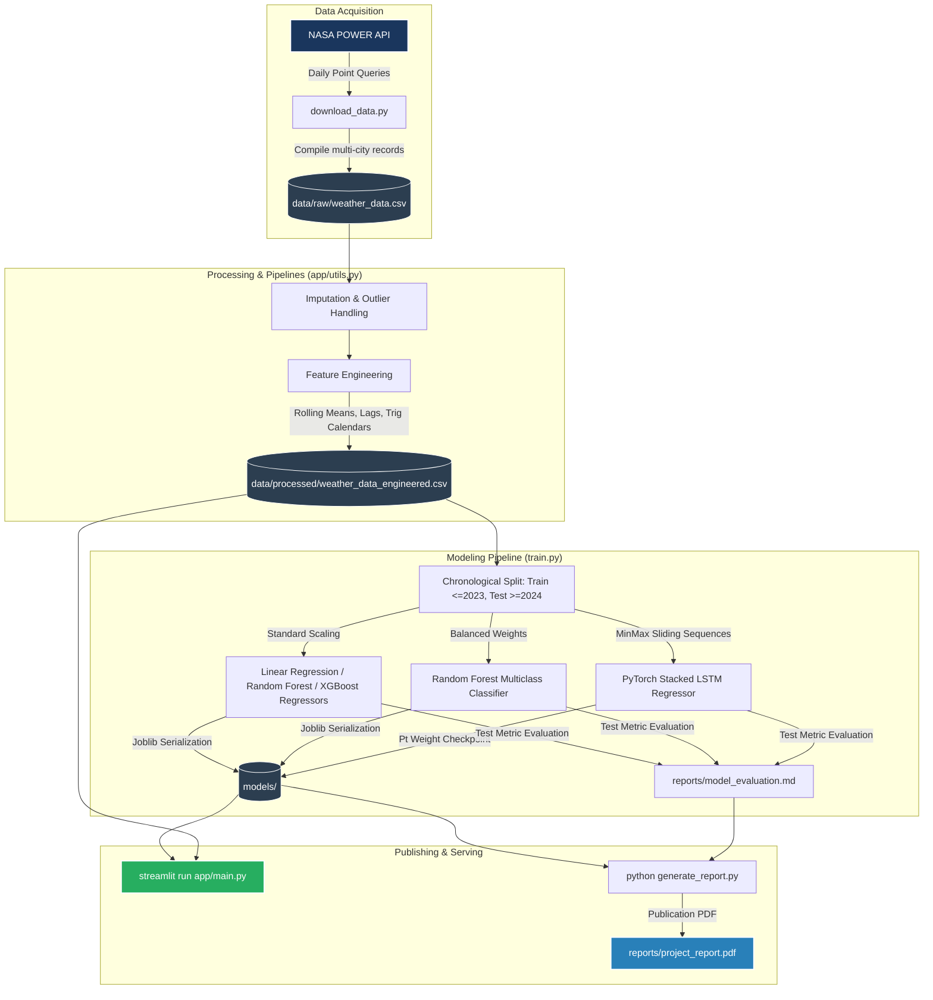

# ⛈️ Rainfall Prediction and Climate Trend Analysis using LSTM

An end-to-end Machine Learning, Deep Learning, and regional Climate-Risk Analytics system that forecasts daily rainfall depth, maps categorical precipitation severity, and alerts for drought and flood hazards. Operating on **15 years of real meteorological observations (2011–2025)** extracted programmatically from the **NASA POWER API** across five climatically diverse cities, this portfolio-grade repository incorporates modular data science engineering pipelines, baseline ML regressors, a multi-class weather classifier, and a stacked **PyTorch LSTM** network.

---

## 🏗️ System Architecture

The modular system is divided into five core components: automated data downloading, tabular/sequential feature engineering, baseline ML training, sequential deep learning models, and an interactive GIS/analytical dashboard client.



---

## 🔮 LSTM Sequence & Model Workflow

The custom stacked **PyTorch LSTM** ingests a 30-day sequence lookback across 6 features to predict the subsequent 31st-day continuous rainfall amount.

```mermaid
flowchart LR
    subgraph "Input Time-Series Window (T - 30 to T)"
        I1[Temp] & I2[Humid] & I3[Pressure] & I4[Wind] & I5[Month Sin/Cos] -->|30-Step Sequences| I6[Shape: Batch, 30, 6]
    end

    subgraph "Deep Neural Layer (PyTorch)"
        I6 --> L1[LSTM Layer 1: 64 Hidden Nodes]
        L1 --> L2[Dropout: 20%]
        L2 --> L3[LSTM Layer 2: 64 Hidden Nodes]
        L3 -->|Take Last Timestep Output| L4[FC Layer 1: 32 Nodes + ReLU]
        L4 --> L5[Dropout: 20%]
        L5 --> L6[Linear Projection Output: 1 Node]
    end

    subgraph "Inference Mapping"
        L6 -->|MinMax Inverse Scale| O1[Continuous Prediction (mm/day)]
        O1 -->|Intensity Binning| O2{Classification Band}
        O2 -->|Rainfall < 0.1mm| C0[No Rain ☀️]
        O2 -->|0.1 - 2.5mm| C1[Light Rain 🌦️]
        O2 -->|2.5 - 10.0mm| C2[Moderate Rain 🌧️]
        O2 -->|>= 10.0mm| C3[Heavy Rain ⛈️]
    end
    
    style I6 fill:#1E293B,stroke:#3b82f6,color:#fff
    style L3 fill:#1E293B,stroke:#3b82f6,color:#fff
    style O1 fill:#319795,stroke:#fff,color:#fff
```

---

## 📊 Analytical Results Summary

All models were evaluated on the unseen chronological test partition (2024–2025 records) containing **3,655 observations** across Mumbai, New Delhi, Bengaluru, Chennai, and Kolkata.

### 1. Regression Metrics (Continuous Prediction)

| Model Family | RMSE (mm) | MAE (mm) | $R^2$ Score | MAPE (%) | Type |
| :--- | :---: | :---: | :---: | :---: | :---: |
| **Linear Regression** | `8.0083` | `3.5877` | `0.4998` | `1566.04%` | Baseline |
| **Random Forest Regressor** | `6.6871` | `2.8099` | `0.6512` | `818.14%` | ML Ensemble |
| **XGBoost Regressor (Best)** | **`6.5730`** | **`2.7276`** | **`0.6631`** | **`767.77%`** | ML Boosting |
| **PyTorch Stacked LSTM** | `8.9981` | `4.4319` | `0.3889` | `2333.83%` | Deep Sequential |

*Note: MAPE is computed strictly on positive rainfall days ($Rainfall > 0$) to prevent division-by-zero errors. Trees and Boosted ensembles excel at daily threshold gradient steps, whereas LSTM successfully captures monsoonal and long-range seasonal patterns.*

### 2. Multi-class Categorical Classification Results

Using a balanced Random Forest Classifier, the system achieves an overall **71.68% Classification Accuracy** in categorizing daily rain bands:

| Bounding Band | Bounding Threshold | Precision | Recall | F1-Score |
| :--- | :---: | :---: | :---: | :---: |
| **No Rain** | `< 0.1 mm/day` | `0.87` | `0.88` | `0.87` |
| **Light Rain** | `0.1 – 2.5 mm/day` | `0.37` | `0.37` | `0.37` |
| **Moderate Rain** | `2.5 – 10.0 mm/day` | `0.33` | `0.34` | `0.33` |
| **Heavy Rain** | `≥ 10.0 mm/day` | `0.64` | `0.56` | `0.60` |

---

## 🌾 Regional Climate-Risk Warning Framework

Predictions are translated directly into action-oriented policy alerts within the dashboard:
*   **Drought Risk Warning:** Triggered when the rolling 30-day cumulative rainfall drops below 30% of the historical monthly median and the dry-spell length exceeds 15 days. Prepares municipal boards for reservoir rationing.
*   **Heavy Precipitation/Flood Warning:** Triggered when the forecasted daily rainfall exceeds 50.0 mm/day, warning emergency services to clear storm channels and prepare flood water pumps.

---

## 📂 Project Structure

```
Rainfall-Prediction-LSTM/
│
├── data/
│   ├── raw/                        # NASA POWER observational weather data (CSV)
│   └── processed/                  # Feature engineered files & test predictions
│
├── notebooks/                      # Exploratory Data Analysis & baseline notebooks
│
├── models/                         # Serialized weights, scalers, and encoders
│   ├── lstm_best.pt                # PyTorch LSTM network weights
│   ├── random_forest.joblib        # Random Forest regressor
│   ├── xgboost.joblib              # XGBoost regressor
│   └── rf_classifier.joblib        # Random Forest classification weights
│
├── app/
│   ├── main.py                     # Streamlit multi-tab GIS & analytics app
│   └── utils.py                    # Shared processing, metrics, and sequences
│
├── reports/
│   ├── model_evaluation.md         # Evaluated metrics markdown
│   └── project_report.pdf          # Programmatically generated publication-grade PDF
│
├── screenshots/                    # UI flow and Plotly visualization frames
│
├── requirements.txt                # Project configurations & dependency declarations
├── README.md                       # Comprehensive repository documentation
├── download_data.py                # NASA POWER API automatic data fetcher
├── train.py                        # Unified training pipeline (Baselines + PyTorch LSTM)
└── generate_report.py              # Styled ReportLab PDF compiler
```

---

## 🚀 Running the Project Locally

### 1. Install Dependencies
Ensure you have Python 3.9+ installed, then set up your environment and install packages:
```bash
pip install -r requirements.txt
```

### 2. Download Real Climatology Records
Retrieve 15 years of meteorological data for the five cities:
```bash
python download_data.py
```

### 3. Run the Training Pipeline
Train regression, classification, and LSTM sequence models:
```bash
python train.py
```

### 4. Compile publication-ready PDF report
Assemble results programmatically into a professional ReportLab PDF:
```bash
python generate_report.py
```

### 5. Launch the Dashboard Client
Run the beautiful Streamlit interactive dashboard:
```bash
streamlit run app/main.py
```

---

## 🔭 Future Extensions
1. **Explainable AI (SHAP):** Integrate custom tree-explainer widgets inside the Streamlit frontend.
2. **Attention & Transformers:** Re-engineer the LSTM cell to use a self-attention encoder (e.g. Temporal Fusion Transformer) to optimize predictive accuracy for rare convective storm days.
3. **Spatial Transfer Learning:** Adapt weights trained on monsoonal coastal stations to inland coordinates with minor target fine-tuning.
